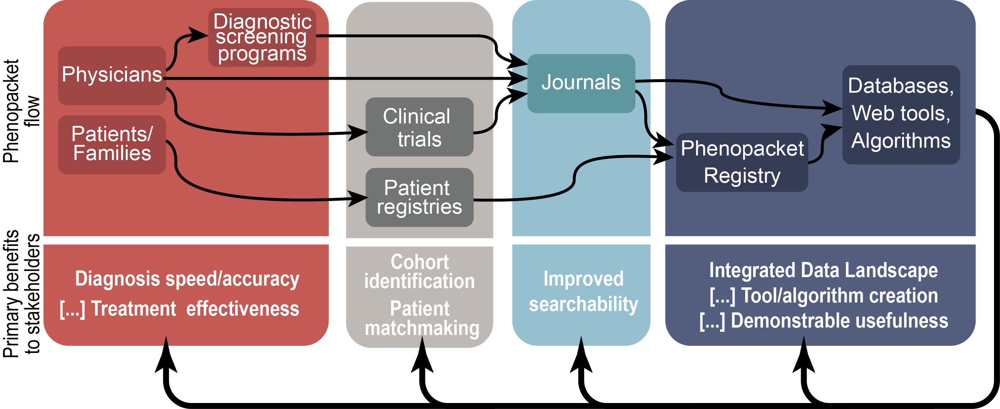

# Conceptual Model and Motivation

The health of an individual organism results from a complex interplay between its genes and environment. Although great strides have been made in standardizing the representation of genetic information for exchange, there are no comparable standards to represent phenotypes (e.g. patient symptoms and disease features) and environmental factors. Phenotypic abnormalities of individual organisms are currently described in diverse places and in diverse formats: publications, databases, health records, registries, clinical trials, and even social media. However, the lack of standardization, accessibility, and computability among these contexts makes it extremely difficult to effectively extract and utilize these data, hindering the understanding of genetic and environmental contributions to disease.

While great strides have been made in exchange formats for sequence and variation data (e.g. Variant Call Format; VCF1), complementary standards for phenotypes and environment are urgently needed. For individuals with rare and undiagnosed diseases, such standards could improve the speed and accuracy of diagnosis. For patients with common but hard-to-treat diseases, such standards can help us design personalized interventions and learn more about shared disease mechanisms2.

The development of a clinical phenotype data exchange standard is both necessary and timely. It is necessary because study sizes of well over 100,000 patients are thought to be required to effectively assess the role of rare variation in common disease3 or to discover the genomic basis for a substantial portion of Mendelian diseases4. It is timely because studies of this power are now becoming financially and technologically tractable.

**Figure 1** *Phenopacket data exchange in the biomedical ecosystem. Multiple providers of phenotypic data include patients and clinicians, via a variety of mechanisms. Such Phenopackets can be created by a variety of tools and consumed by journals, databases, patient matchmaking services, EHR systems, and genomic analysis tools.*

Phenotypic abnormalities of individuals are currently described in diverse places in diverse formats: publications, databases, health records, and even in social media. We propose that these descriptions a) contain a minimum set of fields and b) get transmitted alongside genomic sequence data, such as in VCF, between clinics, authors, journals, and data repositories.  The structure of the data in the exchange standard will be optimized for integration from these distributed contexts. The implementation of such a system will allow the sharing of phenotype data prospectively, as well as retrospectively.  Increasing the volume of computable data across a diversity of systems will support large-scale computational disease analysis using the combined genotype and phenotype data.

The terms ‘disease’ and ‘phenotype’ are often conflated. Here we use ‘phenotype’ to refer to a phenotypic feature, such as hypoglycemia, that is the component of a disease, such as diabetes mellitus type II. The Phenotype Exchange Format (PXF) proposed here is designed to support “deep phenotyping”, a process wherein individual components of each phenotype are observed and documented5.  The PXF requires the use of a common ontology, a logically defined hierarchy of terms, that allows sophisticated algorithmic analysis over medically relevant abnormalities. The Human Phenotype Ontology6 (HPO) was built for this purpose and has been used for genomic diagnostics, translational research, genomic matchmaking, and systems biology applications7–14. The HPO is developed in the context of the Monarch Initiative, an international team of computer scientists, clinicians, and biologists in the United States, Europe, and Australia; HPO is being translated into multiple languages to support international interoperability. Due to its extensive phenotypic coverage beyond other terminologies15,16, HPO has recently been integrated into the Unified Medical Language System (UMLS) to support deep phenotyping in a variety of mainstream health care IT systems.
